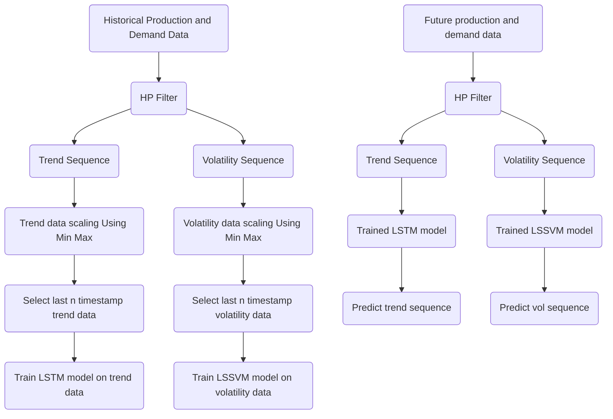

# Problem Statement
In the steel plant considered here, the power requirement of the steel plant is around 200MWh. Out of this, 135MWh can be produced by its captive power plant and the rest power demand can be satisfied by purchasing from outside at some expenses. Outside power suppliers can be government or private. Government power comes from the power grid and is cheaper. But to get this power, the plant has to specify its power demand in advance as this source cannot provide more power than the maximum demand. However, private power is costlier but it does not require any power demand in advance. So, when the steel plant is not able to generate its maximum power of 135MWh and runs out of power shortage due to unknown reasons in advance, it consults private companies for its power demand satisfaction. On the other hand, if demand of the subsidiary plants is not satisfied production is hampered. This increases the operational cost of running the steel plant. In this way, the problem that is identified requires maximization of power generation from CPP. As CPP is generating power at no cost since it uses by-product energy of the plant which is freely available by the production of steel. Instead of this, there are other important problems that should be addressed too. These include energy demand satisfaction of all the subsidiary plants to achieve their production schedule and maintaining a normal holder level to avoid energy gas imbalance in the plant. Thus, for cost-effective and long-term operation of the plant, byproduct gases must be distributed optimally to maximize the power generation keeping other factors into consideration.

# Objeectives and Scope
The overall scope of this work is to build a model that uses the production data for the optimal distribution of energy among the subsidiary plants while achieving the maximum power generation. This work aims at maintaining energy balance in the by-product gas distribution system to avoid sudden and continuous fluctuation of gas holder level. In the long run, with the help of such a model, it can be easier to identify what production can be expected from any subsidiary plant given a particular amount of energy supply. Hence, this work can improve the effectiveness with which the plant is working in the near future by efficiently utilizing the energy. 
The objective of this study is:
- To forecast the production of BFG, COG, LDG and gas consumptions of subsidiary plant.
- To develop a model for maximizing power production from by-product gases in a steel plant by minimizing flaring, maintaining the normal holder level and satisfying the existing energy consumption of subsidiary plants.
- To validate and test the model using real datasets. 

# Model Development
